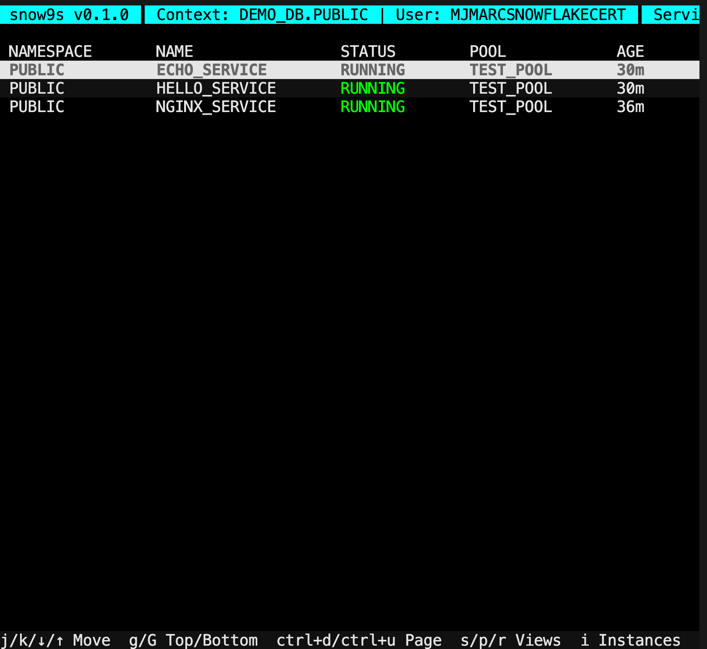

# snow9s

snow9s is a k9s-style terminal dashboard for Snowflake Snowpark Container Services (SPCS). It mirrors the k9s interaction model—full-screen TUI, rapid keyboard navigation, live refresh, and contextual headers/footers—while surfacing SPCS services, their status, compute pools, and age.

## Installation

- Go install (requires Go 1.22+):
  ```bash
  go install github.com/yourusername/snow9s/cmd/snow9s@latest
  ```
- From source:
  ```bash
  make build
  ./bin/snow9s
  ```

## Quick start

1. Export credentials or create `~/.snow9s/config.yaml` (see example below).
2. Run `snow9s` to launch the TUI.
3. Run `snow9s list services` for a non-TUI listing.

## Configuration

snow9s reads environment variables (`SNOWFLAKE_ACCOUNT`, `SNOWFLAKE_USER`, `SNOWFLAKE_PASSWORD`, `SNOWFLAKE_DATABASE`, `SNOWFLAKE_SCHEMA`, `SNOWFLAKE_WAREHOUSE`) and `~/.snow9s/config.yaml`. Override with flags like `--account`.

| Option | Env | Flag | Description |
| --- | --- | --- | --- |
| account | SNOWFLAKE_ACCOUNT | --account | Snowflake account |
| user | SNOWFLAKE_USER | --user | Snowflake user |
| password | SNOWFLAKE_PASSWORD | --password | Password (omit when using keypair) |
| private_key_path | SNOWFLAKE_PRIVATE_KEY_PATH |  | Path to Snowflake RSA private key (p8/PEM) |
| database | SNOWFLAKE_DATABASE | --database | Database name |
| schema | SNOWFLAKE_SCHEMA | --schema | Schema/namespace |
| warehouse | SNOWFLAKE_WAREHOUSE | --warehouse | Warehouse |
| context |  | --context | Named context from config file |
| debug |  | --debug | Show Snowflake queries in debug pane |

Example config (`~/.snow9s/config.yaml`):
```yaml
contexts:
  default:
    account: abc123
    user: myuser
    password: mypassword
    database: MYDB
    schema: PUBLIC
    warehouse: COMPUTE_WH
```

Optional env file: snow9s now creates `~/.snow9s/env` on first run; fill in lines like `SNOWFLAKE_ACCOUNT=abc123` to set SNOWFLAKE_* values without exporting them globally.

A full example is available at `config.example.yaml`.

## Keybindings (k9s-style)

- Navigation: `j/k`, `↓/↑`
- Page: `Ctrl+d` / `Ctrl+u`
- Top/Bottom: `g` / `G`
- Views: `s` Services, `p` Pools, `r` Repos
- Instances: `i` (from Services), `b` back
- Details: `Enter` (opens details pane), `Esc` closes
- Filter: `/` (type to filter), `Esc` clears
- Command: `:` (command mode)
- Refresh: `Ctrl+r`
- Quit: `q` or `Ctrl+c`
- Help: `?`

### Command mode examples

- `:svc` or `:services` — Services view
- `:pool` or `:pools` — Compute pools view
- `:repo` or `:repos` — Image repositories view
- `:inst` — Instances view for the selected service
- `:ns <schema>` — Switch schema (namespace)

## Make targets

- `make build` – build `./bin/snow9s`
- `make test` – run `go test ./...`
- `make run` – build then run
- `make install` – install into `$GOPATH/bin`
- `make clean` – remove build artifacts

## Screenshot



## Notes

- Auto-refreshes services every 5s with a spinner indicator.
- Handles empty results (`No services found in <schema>`) and connection errors with retry hints.
- `--debug` opens a debug pane showing executed Snowflake queries.
